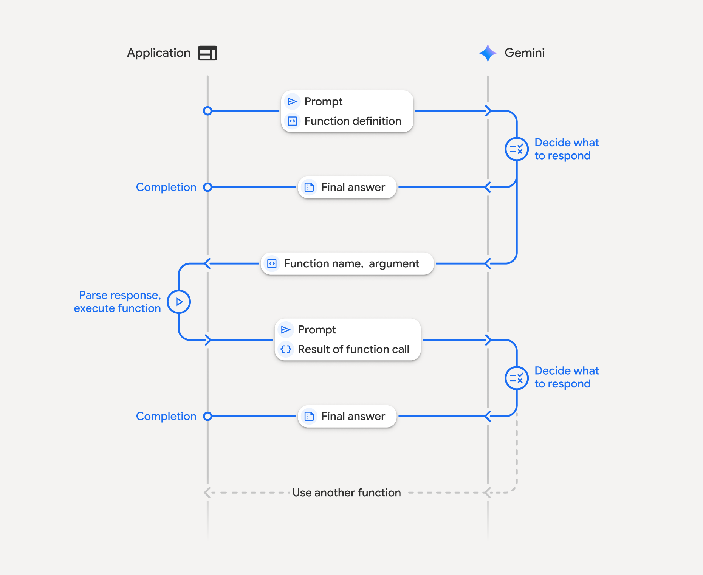

This project use STDIO to connect between MCP server and MCP client

## Build

### Enviroment variables

Create `.env` with Google Gemini API key

```{text}
GEMINI_API_KEY="PUT-YOUR-KEY-HERE"
```

### With uv

Install [uv](https://github.com/astral-sh/uv)

```{bash}
uv sync --locked
uv run fastapi dev client.py
```

### With docker

Install [docker](https://www.docker.com/)

```{bash}
docker build -t finis_ai .
docker run -p 8000:80 finis_ai
```

## Function calling overview


